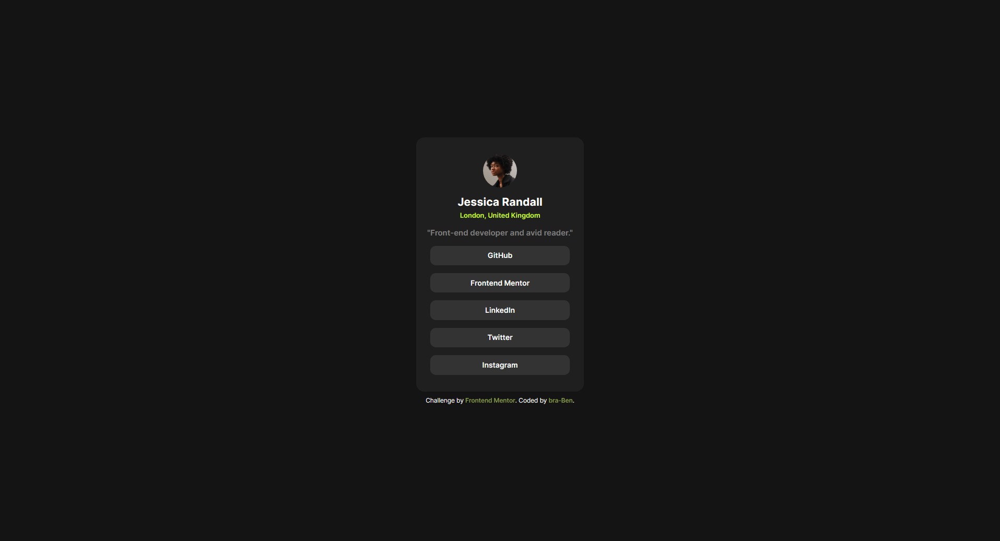

# Frontend Mentor - Social links profile solution

This is a solution to the [Social links profile challenge on Frontend Mentor](https://www.frontendmentor.io/challenges/social-links-profile-UG32l9m6dQ). Frontend Mentor challenges help you improve your coding skills by building realistic projects. 

## Table of contents

- [Overview](#overview)
  - [The challenge](#the-challenge)
  - [Screenshot](#screenshot)
  - [Links](#links)
- [My process](#my-process)
  - [Built with](#built-with)
  - [What I learned](#what-i-learned)
  - [Continued development](#continued-development)
  - [Useful resources](#useful-resources)
- [Author](#author)
- [Acknowledgments](#acknowledgments)

**Note: Delete this note and update the table of contents based on what sections you keep.**

## Overview

### The challenge

Users should be able to:

- See hover and focus states for all interactive elements on the page

### Screenshot

### Links

- Solution URL: [Blog Preview Card](https://www.frontendmentor.io/solutions/social-links-profile-hA_TBSVdTd)
- Live Site URL: [Blog Preview Card ](https://bra-ben.github.io/Social-links-profile-frontendmentors/)

## My process

### Built with

- Semantic HTML5 markup
- Flexbox
- Mobile-first workflow
- Font Face
- focus state

**Note: These are just examples. Delete this note and replace the list above with your own choices**

### What I learned

I got good understand of flexbox and how to set the apporpiate `width` property for an image within a container. 

Helped me to learn how to set `@font-face` in CSS for variable fonts.

I also got an understanding on how to use `flexbox`, `flex-direction`, `transitions` and pseudo attribute like `:hover` and `:focus`

### Continued development

I want to continue to learn how build a responsive site by using Mobile-first workflow and flexbox.

### Useful resources

- [Colt Steele](https://www.youtube.com/@ColtSteeleCode) -  Colt Steel is a great guy and his tutorials on Flexbox really helped me on this project.
- [Kevin Powell](https://www.youtube.com/@KevinPowell) -  Has indepth knowledge on CSS and tutorial on `:focus` state in CSS really helped me in this challenge.
- [Mozilla Developer Network](https://developer.mozilla.org/en-US/) - MDN always come to the rescue when i am lost.
- [ChatGPT](https://chat.openai.com/c/0d367de6-d458-4342-8f15-ee747dac9b25)

## Author

- Website - [Benjamin Darko Appiagyei](https://www.linkedin.com/in/bendarko/)
- Frontend Mentor - [@bra-Ben](https://www.frontendmentor.io/profile/bra-Ben)
- Twitter - [@bnjdarko](https://www.twitter.com/bnjdarko)

## Acknowledgments

Great appreciation goes out to the brain or brains behind Frontend Mentors. Without you guys, the dreams of thousands of people around the world of becoming a Web Developers won't be possible. God bless you.
